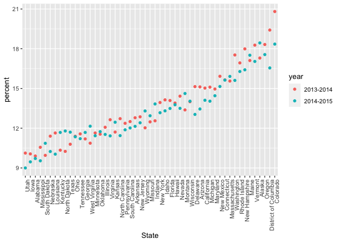
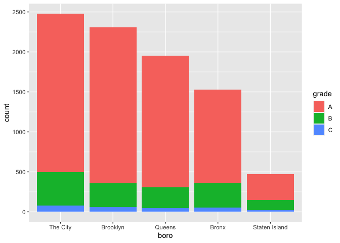

strings\_and\_factors
================

``` r
library(rvest)
library(tidyverse)
```

    ## ── Attaching packages ─────────────────────────────────────── tidyverse 1.3.1 ──

    ## ✓ ggplot2 3.3.5     ✓ purrr   0.3.4
    ## ✓ tibble  3.1.2     ✓ dplyr   1.0.7
    ## ✓ tidyr   1.1.3     ✓ stringr 1.4.0
    ## ✓ readr   2.0.1     ✓ forcats 0.5.1

    ## ── Conflicts ────────────────────────────────────────── tidyverse_conflicts() ──
    ## x dplyr::filter()         masks stats::filter()
    ## x readr::guess_encoding() masks rvest::guess_encoding()
    ## x dplyr::lag()            masks stats::lag()

``` r
library(p8105.datasets)
```

# Introduction to String Variables

``` r
string_vec = c("my", "name", "is", "jeff")

str_detect(string_vec, "jeff")
```

    ## [1] FALSE FALSE FALSE  TRUE

``` r
str_replace(string_vec, "e","This is an uppercase E")
```

    ## [1] "my"                        "namThis is an uppercase E"
    ## [3] "is"                        "jThis is an uppercase Eff"

``` r
str_replace(string_vec, "jeff", "")
```

    ## [1] "my"   "name" "is"   ""

``` r
string_vec = c(
  "i think we all rule for participating",
  "i think i have been caught",
  "i think this will be quite fun actually",
  "it will be fun, i think"
  )

str_detect(string_vec, "^i think")
```

    ## [1]  TRUE  TRUE  TRUE FALSE

``` r
# ^ the beginning of the line
str_detect(string_vec, "i think$")
```

    ## [1] FALSE FALSE FALSE  TRUE

``` r
string_vec = c(
  "Y'all remember Pres. HW Bush?",
  "I saw a green bush",
  "BBQ and Bushwalking at Molonglo Gorge",
  "BUSH -- LIVE IN CONCERT!!"
  )

str_detect(string_vec, "Bush")
```

    ## [1]  TRUE FALSE  TRUE FALSE

``` r
str_detect(string_vec,"[Bb]ush")
```

    ## [1]  TRUE  TRUE  TRUE FALSE

``` r
# [ ] either upper case or lower case works 


string_vec = c(
  '7th inning stretch',
  '1st half soon to begin. Texas won the toss.',
  'she is 5 feet 4 inches tall',
  '3AM - cant sleep :('
  )

str_detect(string_vec, "^[0-9][a-zA-Z]")
```

    ## [1]  TRUE  TRUE FALSE  TRUE

``` r
string_vec = c(
  'Its 7:11 in the evening',
  'want to go to 7-11?',
  'my flight is AA711',
  'NetBios: scanning ip 203.167.114.66',
  '7a11',
  '7bb11'
  )

str_detect(string_vec, "7.11")
```

    ## [1]  TRUE  TRUE FALSE  TRUE  TRUE FALSE

``` r
# we do not care what is in the center 


string_vec = c(
  'The CI is [2, 5]',
  ':-]',
  ':-[',
  'I found the answer on pages [6-7]'
  )

str_detect(string_vec, "\\[")
```

    ## [1]  TRUE FALSE  TRUE  TRUE

``` r
# \\ indicates you want to actually find this bracket 
```

# Why factors are werid

``` r
vec_sex = factor(c("male", "male", "female", "female"))
vec_sex
```

    ## [1] male   male   female female
    ## Levels: female male

``` r
as.numeric(vec_sex)
```

    ## [1] 2 2 1 1

``` r
vec_sex = fct_relevel(vec_sex, "male")
vec_sex
```

    ## [1] male   male   female female
    ## Levels: male female

``` r
# make male factor 1 

as.numeric(vec_sex)
```

    ## [1] 1 1 2 2

# National Survey on Drug Use and Health Data

``` r
nsduh_url = "http://samhda.s3-us-gov-west-1.amazonaws.com/s3fs-public/field-uploads/2k15StateFiles/NSDUHsaeShortTermCHG2015.htm"

table_marj = 
  read_html(nsduh_url) %>% 
  html_table() %>% 
  first() %>%
  slice(-1)

data_marj = 
  table_marj %>%
  select(-contains("P Value")) %>%
  pivot_longer(
    -State,
    names_to = "age_year", 
    values_to = "percent") %>%
 #  separate(age_year, into = c("age", "year"), -11)
  separate(age_year, into = c("age", "year"), sep = "\\(") %>%
  mutate(
    year = str_replace(year, "\\)", ""),
    # replace close parentasis and reaplce with nothing 
    percent = str_replace(percent, "[a-c]$", ""),
    percent = as.numeric(percent)) %>%
  filter(!(State %in% c("Total U.S.", "Northeast", "Midwest", "South", "West")))
```

Plot the data frame

``` r
data_marj %>%
  filter(age == "12-17") %>% 
  mutate(State = fct_reorder(State, percent)) %>% 
  # allows you to reorder state by percent 
  ggplot(aes(x = State, y = percent, color = year)) + 
    geom_point() + 
    theme(axis.text.x = element_text(angle = 90, hjust = 1))
```

<!-- -->

``` r
  # rotates X axis labels 
```

## Resturant Inspection

``` r
data("rest_inspec")

rest_inspec %>% 
   janitor::clean_names()
```

    ## # A tibble: 397,584 x 18
    ##    action        boro   building   camis critical_flag cuisine_descrip… dba     
    ##    <chr>         <chr>  <chr>      <int> <chr>         <chr>            <chr>   
    ##  1 Violations w… MANHA… 425       4.15e7 Not Critical  Italian          SPINELL…
    ##  2 Violations w… MANHA… 37        4.12e7 Critical      Korean           SHILLA …
    ##  3 Violations w… MANHA… 15        4.11e7 Not Critical  Café/Coffee/Te… CITY PE…
    ##  4 Violations w… MANHA… 35        4.13e7 Critical      Korean           MADANGS…
    ##  5 Violations w… MANHA… 1271      5.00e7 Critical      American         THE HAR…
    ##  6 Violations w… MANHA… 155       5.00e7 Not Critical  Donuts           DUNKIN …
    ##  7 Violations w… MANHA… 1164      5.00e7 Critical      Salads           SWEETGR…
    ##  8 Violations w… MANHA… 37        4.12e7 Not Critical  Korean           SHILLA …
    ##  9 Violations w… MANHA… 299       5.01e7 Not Critical  American         PRET A …
    ## 10 Violations w… MANHA… 53        4.04e7 Not Critical  Korean           HAN BAT…
    ## # … with 397,574 more rows, and 11 more variables: inspection_date <dttm>,
    ## #   inspection_type <chr>, phone <chr>, record_date <dttm>, score <int>,
    ## #   street <chr>, violation_code <chr>, violation_description <chr>,
    ## #   zipcode <int>, grade <chr>, grade_date <dttm>

``` r
rest_inspec =
  rest_inspec %>%
  filter(grade %in% c("A", "B", "C"), boro != "Missing") %>% 
  mutate(boro = str_to_title(boro))
```

``` r
rest_inspec %>% 
  filter(str_detect(dba, "[Pp][Ii][Zz][Zz][Aa]")) %>% 
  mutate(
    boro = str_replace(boro, "Manhattan", "The City"),
    boro = fct_infreq(boro)
    # make sure you but str_replace first 
  ) %>% 
  ggplot(aes(x = boro, fill = grade)) + 
  geom_bar() 
```

<!-- -->

``` r
rest_inspec %>% 
  filter(str_detect(dba, "[Pp][Ii][Zz][Zz][Aa]")) %>% 
  mutate(
    boro = fct_infreq(boro),
    boro = fct_recode(boro, "The City" = "Manhattan")
  ) %>% 
  ggplot(aes(x = boro, fill = grade)) + 
  geom_bar() 
```

<!-- -->
